# Cisco Live US 2022 - DEVWKS-3270
## Version 17.10

# Lab Introduction
This lab focus on the configuration of a Catalyst 9300 switch and and a Ubuntu VM machine that has the necessary software dependencies to reproduce the MDT contents reviewed during the presentation. 

You will access the lab via SSH. Please find below the actual lab environment and the instructions to continue. 


# Lab Environment
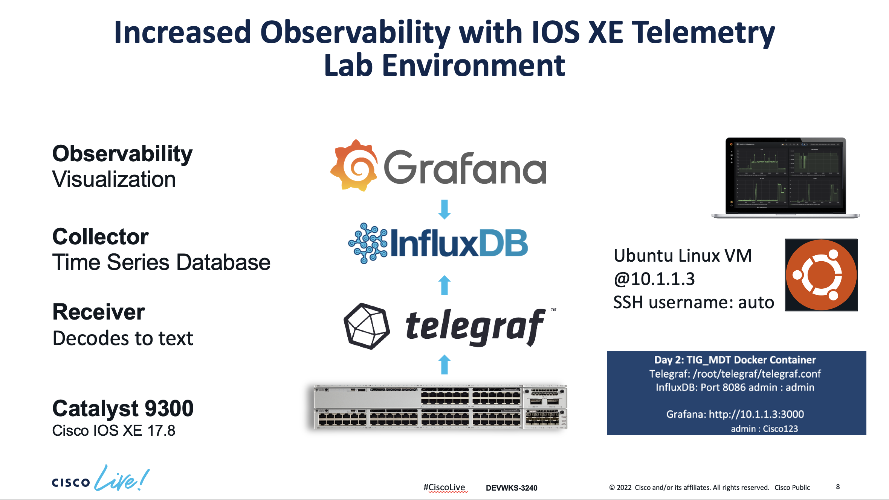


# Lab Configuration

## MDT Subscription Configuration


# Accessing the lab environment 

1. Identify your pod#.
 
2. Open two terminal windows and SSH to both. One window will be used to configure the VM. The second window is for telnet access into the C9300.

3. To SSH into the devices, copy/paste the below line into each of the terminal sessions. Replace the ## symbol on the SSH command with your pod number. Use the password given to you by the facilitator.

```ssh -p 3389 -L 18480:localhost:8480 -L 13000:localhost:3000 auto@pod##-xelab.cisco.com```

    Once you logged into the VM, the first time you login, you'll see this question:

`Are you sure you want to continue connecting (yes/no/[fingerprint])?` 

Type, `yes` to continue 

After you approve the entry you should be able to see the following prompt:

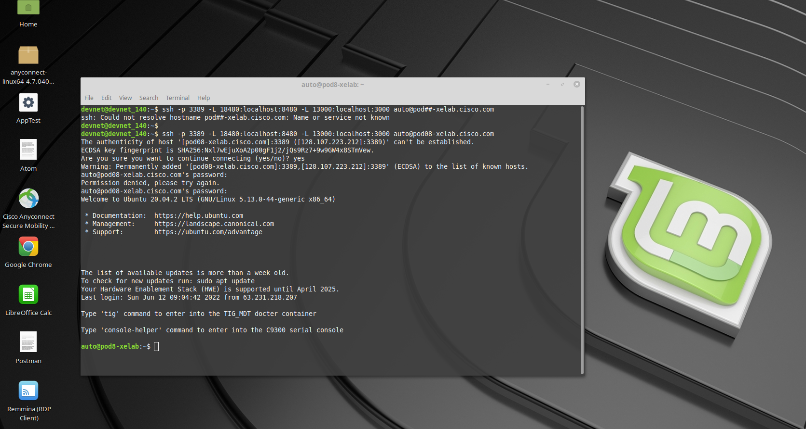


4. Telnet into the Catalyst 9300 into the second window that you opened before. Use the following credentials: admin / Cisco123

5. Once you finished accesing via SSH and telnet into the VM and the switch respectively, this is how you should see them:
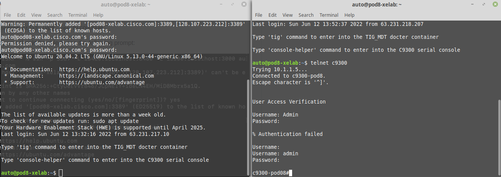


# Review YANG Suite

Login to YANG Suite and load the CPU YANG model

YANG Suite is accessible at http://localhost:18480 via the tunnel and the credentials are the same as the C9300 at admin/Cisco123

This is an interaction section - follow along with the proctor


# Configuring Telemetry Subscriptions on the Catalyst 9300

The next step is configure the telemetry subscriptions. This consists of several configuration steps:

1. Every process that you need to monitor from the device requires a subscription. We will create four subscriptions to monitor the following aspects: CPU, Power, Memory and Temperature.

1. In our case, the type of encoding is: ‘encode-kvgpb’

1. YANG Push can be used to monitor configuration or operational datastore changes. We will use: ‘ stream yang-push’ 

1. Periodicity. Tells how frequently we want to send the traffic (in milliseconds) to the receiver of the traffic.

1. Specify the receiver of the traffic, in this case is the switch: 10.1.1.5. 

1. Copy & paste or enter the following commands, exactly as they appear on the Catalyst 9300:

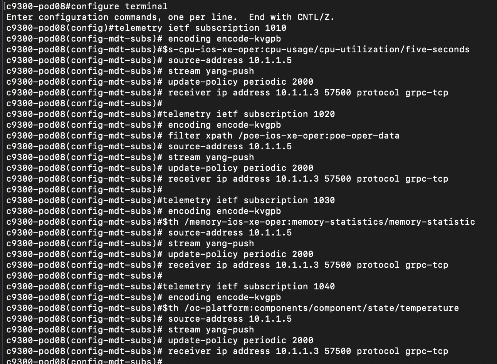

```
configure terminal
telemetry ietf subscription 1010
encoding encode-kvgpb
filter xpath /process-cpu-ios-xe-oper:cpu-usage/cpu-utilization/five-seconds
source-address 10.1.1.5
stream yang-push
update-policy periodic 6000
receiver ip address 10.1.1.3 57500 protocol grpc-tcp

telemetry ietf subscription 1020
encoding encode-kvgpb 
filter xpath /poe-ios-xe-oper:poe-oper-data
source-address 10.1.1.5
stream yang-push
update-policy periodic 6000
receiver ip address 10.1.1.3 57500 protocol grpc-tcp

telemetry ietf subscription 1030
encoding encode-kvgpb
filter xpath /memory-ios-xe-oper:memory-statistics/memory-statistic
source-address 10.1.1.5
stream yang-push
update-policy periodic 6000
receiver ip address 10.1.1.3 57500 protocol grpc-tcp
 
telemetry ietf subscription 1040
encoding encode-kvgpb
filter xpath /oc-platform:components/component/state/temperature
source-address 10.1.1.5
stream yang-push
update-policy periodic 6000
receiver ip address 10.1.1.3 57500 protocol grpc-tcp
```

 
 
 
 # Increased Observability with IOS XE Telemetry displayed in Grafana

Grafana is an open source solution for running data analytics, it pulls up selective metrics out of the huge amount of data that we are ingesting daily from our devices and apps with the help of customizable dashboards.

Grafana connects with every possible data source or databases such as Graphite, Prometheus, Influx DB, ElasticSearch, MySQL, PostgreSQL etc. In this case we will extract the information from the subscriptions that were created before on the switch. This data has been sent from the switch to Influx DB. Now, we will pass this data into Grafana for visualization.

Grafana being an open source solution also enables us to write plugins from scratch for integration with several different data sources.

## Open the following browser URL to access the Grafana dashboard 
```http://localhost:13000/```

Username: admin

Password: Cisco123

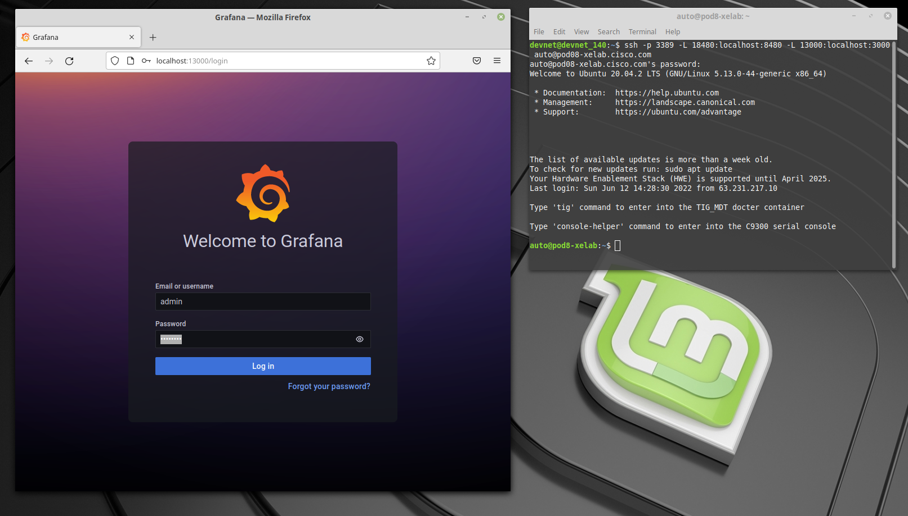

The CPU Utilization streaming telemetry data, the average and current memory consumption patterns, the temperature levels (max, min, avg) and power readings that were configured earlier are now visible in the pre-configured charts. 

This shows the telemetry data that was configured earlier in this lab using Grafana for visualization of the data.

# Explore the TIG

# gRPC Dial-Out Configured Subscriptions

Lets continue by checking the subscriptions configured on the Catalyst 9300.

Step 1. Open a SSH connection to the Catalyst 9300 switch

Step 2. Check the subscription configured on the device using the following IOS XE CLI

**C9300# show run | sec telemetry**

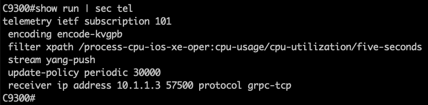

Lets analyze the main parts of the subscription configuration:

- telemetry ietf subscription 101 (subscription ID)
- encoding encode-kvgpb (Key-Value pair encoding)
- filter xpath /process-cpu-ios-xe-oper:cpu-usage/cpu-utilization/five-seconds (xpath)
- update-policy periodic 500 (period in 1/100 seconds, 5 secs here)
- receiver ip address 10.1.1.3 57500 protocol grpc-tcp (receivers IP, port and protocol)

This telemetry configuration has already been applied to the switch. However, if it needs to be re-applied the following can be used to easily copy/paste:

```
conf t
telemetry ietf subscription 101
encoding encode-kvgpb
filter xpath /process-cpu-ios-xe-oper:cpu-usage/cpu-utilization/five-seconds
source-address 10.1.1.5
stream yang-push
update-policy periodic 500
receiver ip address 10.1.1.3 57500 protocol grpc-tcp

```

Step 3. Verify the configured subscription using the following **telemetry** IOS XE CLIs

**c9300# sh telemetry ietf subscription all**

```

Telemetry subscription brief

ID               Type        State       Filter type
-----------------------------------------------------
101              Configured  Valid       xpath

```


**c9300# sh telemetry ietf subscription 101 detail**

```
Telemetry subscription detail:

Subscription ID: 101
Type: Configured
State: Valid
Stream: yang-push
Filter:
Filter type: xpath
XPath: /process-cpu-ios-xe-oper:cpu-usage/cpu-utilization/five-seconds
Update policy:
Update Trigger: periodic
Period: 500
Encoding: encode-kvgpb
Source VRF:
Source Address: 10.1.1.5
Notes:

Receivers:
Address          Port             Protocol         Protocol Profil
------------------------------------------------------------------
10.1.1.3         57500            grpc-tcp

```

**c9300# sh telemetry ietf subscription 101 receiver**

```
Telemetry subscription receivers detail:

Subscription ID: 101
Address: 10.1.1.3
Port: 57500
Protocol: grpc-tcp
Profile:
State: Connected
Explanation:
```


The State should report **Connected**.

If that state does not show Connected, for example, if it is the  "Connecting " state, then simple remove and re-add the telemetry configuration before continuing with the next steps and troubleshooting:

```
conf t
no telemetry ietf subscription 101
telemetry ietf subscription 101
encoding encode-kvgpb
filter xpath /process-cpu-ios-xe-oper:cpu-usage/cpu-utilization/five-seconds
source-address 10.1.1.5
stream yang-push
update-policy periodic 500
receiver ip address 10.1.1.3 57500 protocol grpc-tcp
```

Note: If the state does not show  "Connected" then ensure the Docker container with the Telegraf receiver is running correctly. Follow the next steps to confirm status of each component.


## Telegraf, Influx, Grafana (TIG)

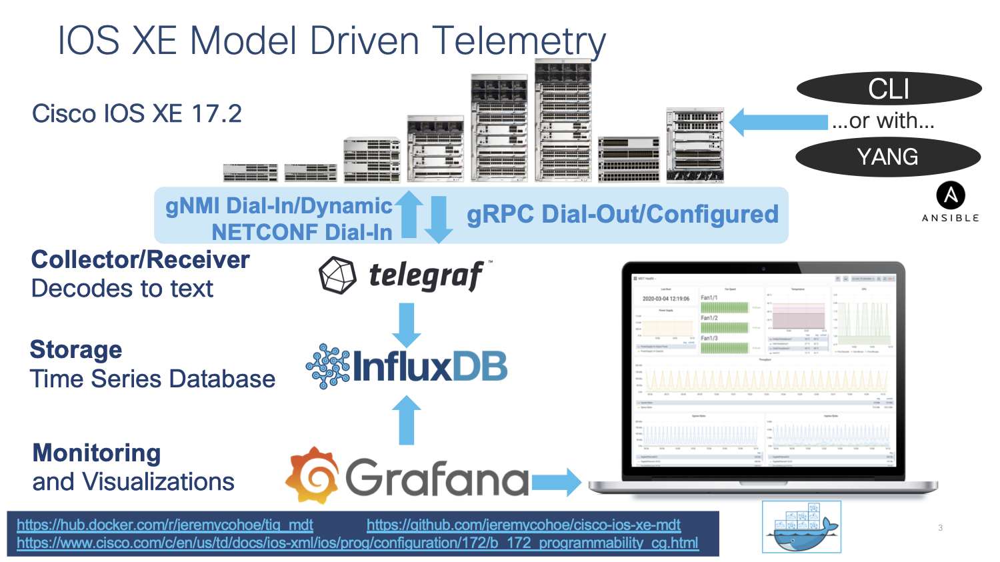

Telegraf is the tool that receives and decodes the telemetry data that is sent from the IOS XE devices. It processes the data and sends it into the InfluxDB datastore, where Grafana can access it in order to create visualizations.

Telegraf runs inside the  "tig_mdt" Docker container. To connect to this container from the Ubuntu host follow the steps below:

```
auto@automation:~$ docker ps
```

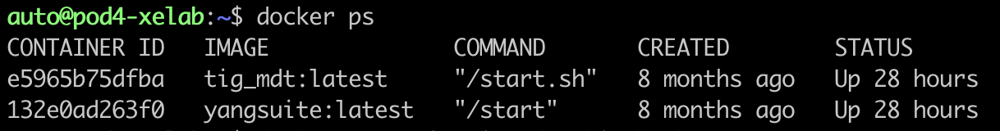

```
auto@automation:~$ docker exec -it tig_mdt /bin/bash

 <You are now within the Docker container>

# cd /root/telegraf
# ls
```

There is one file for each telemetry interface: **NETCONF**, **gRPC**, and **gNMI**. Review each file to understand which. YANG data is being collected by which interface.

```
# cat telegraf-grpc.conf
# cat telegraf-gnmi.conf
# cat telegraf-netconf.conf
```

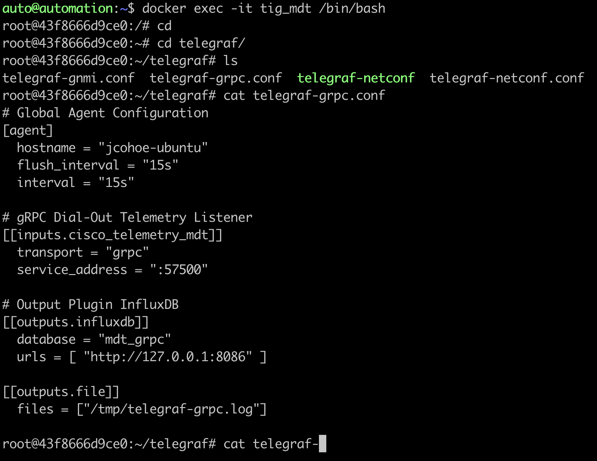

Inside the Docker container navigate to the telegraf directory and review the configuration file and log by tailing the log file with the command **tail -F /tmp/telegraf-grpc.log** 

The **telegraf-grpc.conf** configuration file shows us the following:

**gRPC Dial-Out Telemetry Input:** This defines the telegraf plugin (cisco\_telemetry\_mdt) that is being used to receive the data, as well as the port (57500)

**Output Plugin:** This defines where the received data is sent to (outputs.influxdb) the database to use (telegraf) and the URL for InfluxDB ([http://127.0.0.1:8086](http://127.0.0.1:8086/))

**Outputs.file** : sends a copy of the data to the text file at /root/telegraf/telegraf.log

These configuration options are defined as per the README file in each of the respective input or output plugins. For more details of the cisco_telemetry_mdt plugin that is in use here, see the page at ["https://github.com/influxdata/telegraf/tree/master/plugins/inputs/cisco_telemetry_mdt"]("https://github.com/influxdata/telegraf/tree/master/plugins/inputs/cisco_telemetry_mdt")

Examining the output of the telegraf.log file shows the data coming in from the IOS XE device that matches the subscription we created and do ctrl+c to stop the output

**# tail -F /tmp/telegraf.log**

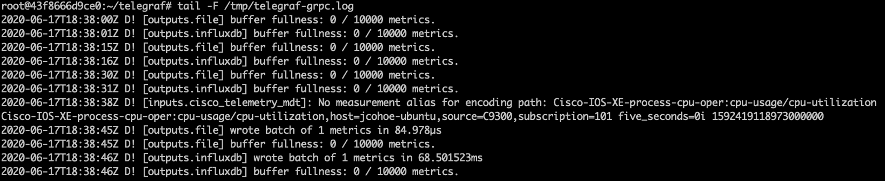

## The Influx Database (influxdb)


InfluxDB is already installed and started within the same Docker container. Lets verify it s working correctly by connecting into the Docker contain where it is running.

Step 1. Verify InfluxDB is running with the command **ps xa | grep influx**

```
15 pts/0 Sl+ 1:45 /usr/bin/influxd -pidfile /var/run/influxdb/influxd.pid -config /etc/influxdb/influxdb.conf
```

Step 2. Verify the data stored on the Influx database using the command shown below:

```
root@43f8666d9ce0:~# influx
Connected to http://localhost:8086 version 1.7.7
InfluxDB shell version: 1.7.7
> show databases
name: databases
name
----
_internal
mdt_gnmi
mdt_grpc
cisco_mdt
mdt_netconf
>
> drop database cisco_mdt
> quit
root@43f8666d9ce0:~#
root@43f8666d9ce0:~#
root@43f8666d9ce0:~#
root@43f8666d9ce0:~#
root@43f8666d9ce0:~#
root@43f8666d9ce0:~#
root@43f8666d9ce0:~# influx
Connected to http://localhost:8086 version 1.7.7
InfluxDB shell version: 1.7.7
>
> show databases
name: databases
name
----
_internal
mdt_gnmi
mdt_grpc
mdt_netconf
>
> use mdt_grpc
Using database mdt_grpc
> show measurements
name: measurements
name
----
Cisco-IOS-XE-process-cpu-oper:cpu-usage/cpu-utilization
>
> SELECT COUNT("five_seconds") FROM "Cisco-IOS-XE-process-cpu-oper:cpu-usage/cpu-utilization"
name: Cisco-IOS-XE-process-cpu-oper:cpu-usage/cpu-utilization
time count
---- -----
0    1134
>
```

The output above shows:

- a **telegraf** dababase as defined in the Telegraf config file which holds that telemetry data
- one measurement defined as the YANG model used for the gRPC Dial-out subscription (Cisco-IOS-XE-process-cpu-oper:cpu-usage/cpu-utilization)
- number of publications received so far (33251).

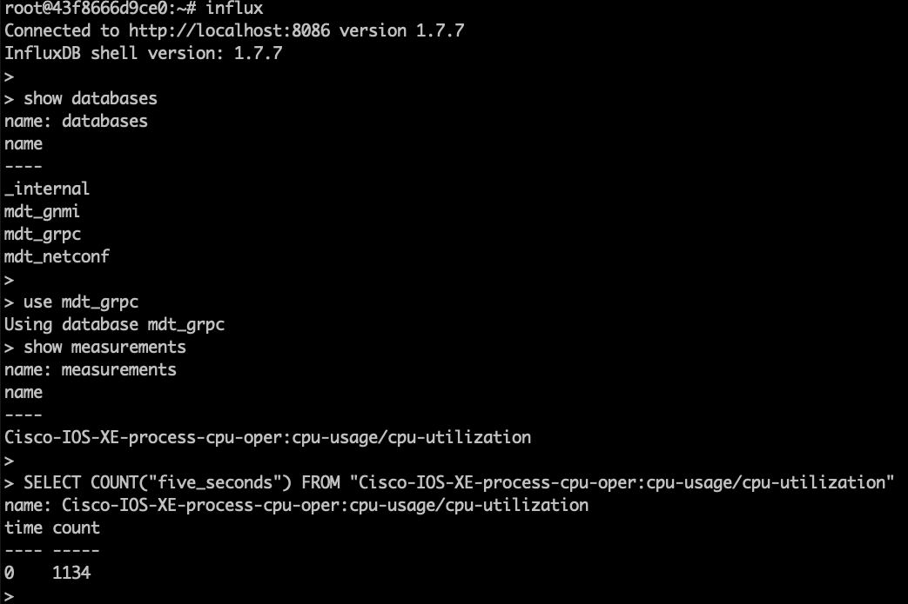

# Grafana Dashboard

Grafana is an open-source platform to build monitoring and analytics dashboards that also runs within the Docker container. Navigating to the web based user interface allows us to see the dashboard with the Model Driven Telemetry data

Verify Grafana is running: with the following command: **ps xa | grep grafana**

```
44 ? Sl 0:32 /usr/sbin/grafana-server --pidfile=/var/run/grafana-server.pid --config=/etc/grafana/grafana.ini --packaging=deb cfg:default.paths.provisioning=/etc/grafana/provisioning cfg:default.paths.data=/var/lib/grafana cfg:default.paths.logs=/var/log/grafan cfg:default.paths.plugins=/var/lib/grafana/plugins**
```

Step 1. Open Firefox or Chrome and access the interface Grafana at [http://10.1.1.3:3000](http://10.1.1.3:3000/)

You should see the following dashboard after logging in with admin:Cisco123

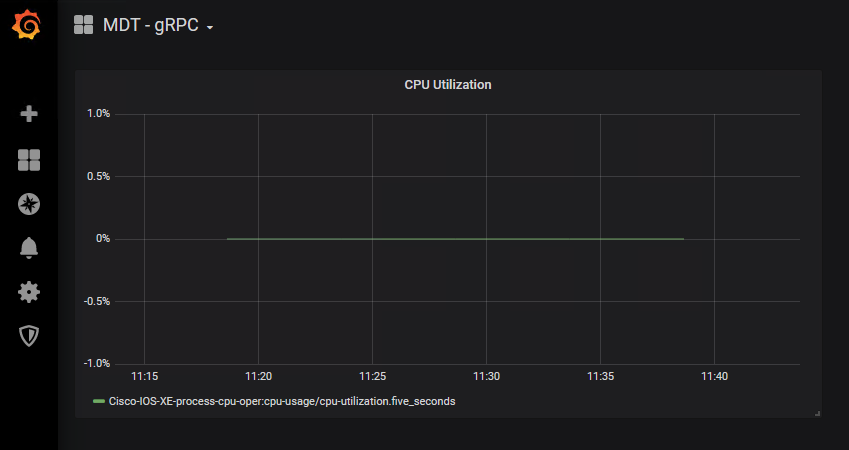

To better understand the Grafana dashboard, lets edit the dashlet to see which data is being displayed:

Step 2. Access the Grafan UI on HTT port 3000
Step 3. Click the **"CPU Utilization"** drop-down and then select **"Edit "**

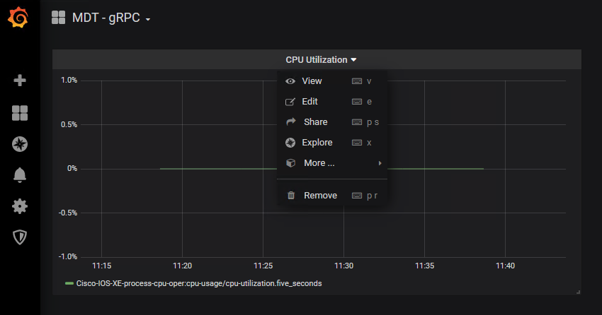

Step 4. Review the information this is pre-configured for this particular chart, specifically the FROM and SELECT sections

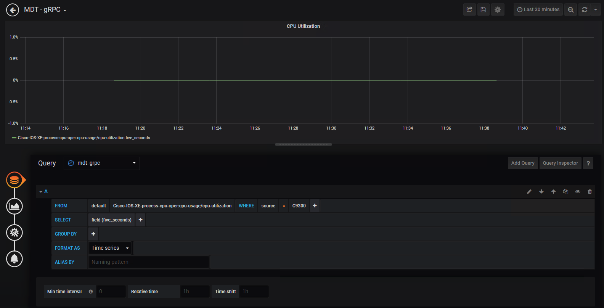

# Summary

On this lab we explore the capabilities of Increased Observability with IOS XE gRPC Dial-Out, Telegraf, InfluxDB, and Grafana - including the tig_mdt Docker container to enhance the management alternatives via MDT capabilities securely.
Cisco IOS XE is fully managed via YANG data models and the Model Driven Telemetry API's across the whole lifecycle. 


## Follow up on MDT
Please make sure to complete the session survey in the Cisco Events App.

Additional feedback is also being collected in the SmartSheet form during and after the event - please leave a comment on this lab at:

https://app.smartsheet.com/b/form/134240eac2d84a57acd4efc24fd8f3d0

Thank you!